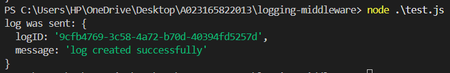

# Logging Middleware

This project implements a basic logging middleware that authenticates using a client ID and secret, retrieves an access token, and uses it to send log data to a remote evaluation server.

---

## Folder Structure
logging-middleware/
├── auth.js # Used to fetch access token
├── log.js # Exports the log() function to send logs
├── test.js # Sample test file to invoke log()
├── package.json
└── README.md

---

## Setup

1. Navigate to the `logging-middleware` folder.
2. Install dependencies (if needed):
   ```bash
   npm install
3. Make sure you're using Node.js version 14 or above.

## Authentication

Run the following to get your access token:
    ```bash
    node auth.js
## Sending a Log

After updating the token, test the logging function:
    ```bash
        node test.js

## expected output 

 ```bash
        log was sent: {
        logID: 'xxxxxxxx-xxxx-xxxx-xxxx-xxxxxxxxxxxx',
        message: 'log created successfully'
        }
        